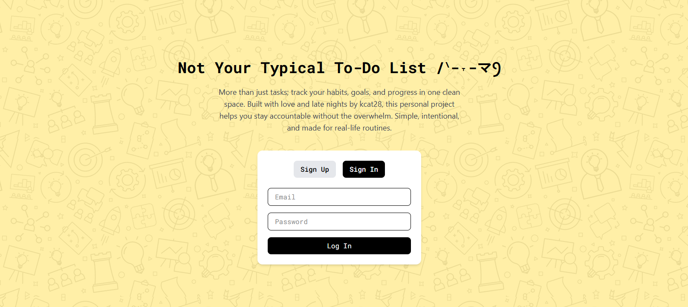
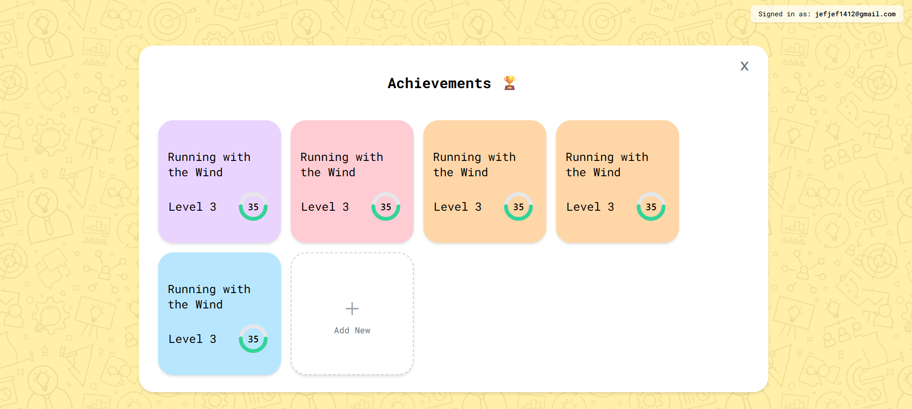

# Not-Your-Typical-To-Do-List-App

More than just tasks — track your habits, goals, and progress in one clean, focused space.  
Built with love (and a few late nights) by **kcat28**, this personal project is designed to help you stay accountable without the overwhelm.  
Simple, intentional, and made for real-life routines.

Powered by **Vite**, **React**, **Tailwind CSS**, and **Firebase**.

---

### 🚧 Project Status  
This project is currently **paused** — not in active development or deployment.  
While I don’t plan to finish it soon, I’m still proud of what I explored and learned while building it.  
It served as a great hands-on exercise with React, Firebase, and modern frontend tooling.

---

### ✅ Features Implemented

- ✍️ **Create Notes**  
- 📖 **Read Notes**  
- 🔐 **Authentication** – Sign In / Sign Up with Firebase Auth  
- 🎨 **Responsive UI/UX** with Tailwind CSS  
- 📝 **Dynamic Rich Text Editor** using Quill  
- ☁️ **Cloud Firestore Integration**  
- 💻 **Complete Front-End Views** for note-taking and habit tracking  

---

### 📸 Screenshots

#### ✨ Landing Page  

#### 🏠 Home View  

#### 🗂️ Achievement Page  

